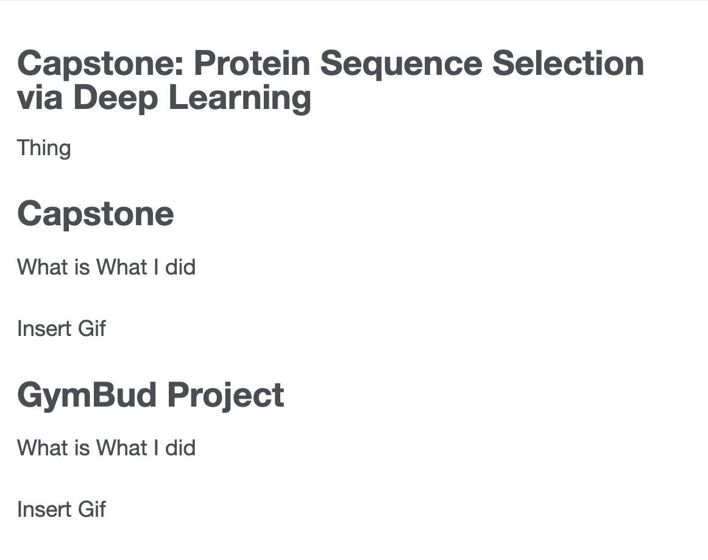

---

permalink: /

title: "Capstone: Protein Sequence Selection via Deep Learning"
excerpt: "About me"

author_profile: true

redirect_from: 

  - /about/

  - /about.html

---

Thing

Capstone
======
What is
What I did

Insert Gif

GymBud Project
======
What is
What I did

Insert Gif

GAN Paper Implementation
------
Process

QEC QAE Paper Implementation
------
Process

Web Cyber Security Analysis
------

[//]: # (![Security_Analysis_Report]&#40;../pdfs/Security_Analysis_Report.png&#41;)

<ul>
<li  markdown="1">

</li>
</ul>

Education
------
UBC Computer Engineering

About Me
------
Contact me

